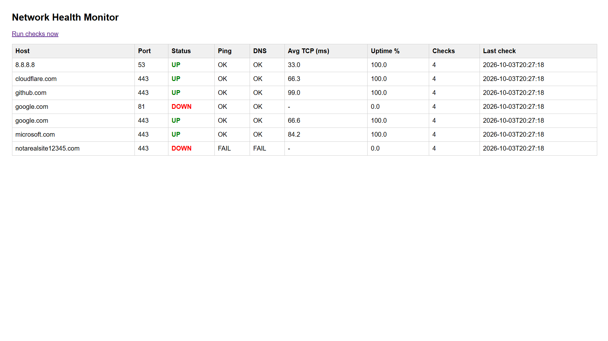
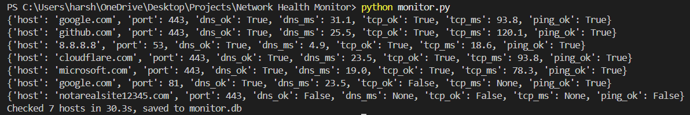
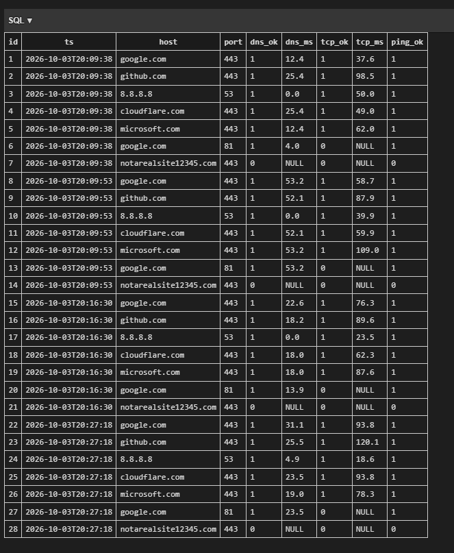

# Network Health Monitor

A Python tool that checks hosts for reachability, open TCP ports and DNS resolution, stores results in SQLite, and shows them on a Flask dashboard.

## Features
- DNS lookup time, TCP port check with latency, and ICMP ping per host
- Parallel checks with ThreadPoolExecutor 
- Every check stored in SQLite with a timestamp
- Dashboard with UP/DOWN status, average latency, uptime % and check count

## How it works
hosts.txt -> monitor.py (checks in parallel) -> monitor.db (SQLite) -> app.py (Flask) -> browser

## Run it
pip install flask
python app.py
Open http://127.0.0.1:5000 and click "Run checks now".

## What I learned
- Ping OK does not mean the service is up (see google.com:81 in the screenshot)
- Network checks are I/O-bound, so threads help
- Debugged a dashboard showing DNS FAIL everywhere: the SQL query never selected the dns_ok column

## Limitations / next steps
- Runs locally on Flask's dev server, not deployed
- No alerting yet
- Next: email/Telegram alerts, SSL expiry check, a latency chart
